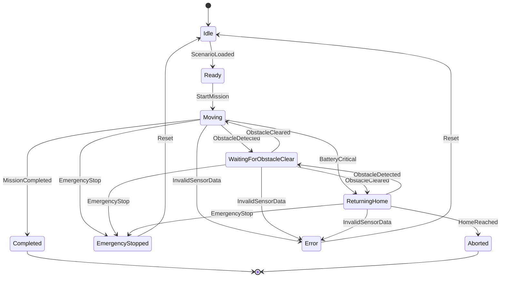

# RobotStateMachine — State Diagram

This diagram reflects the transition table actually implemented in
[`src/RobotStateMachine.cpp`](../src/RobotStateMachine.cpp). It is not an
aspirational design — every arrow below corresponds to a `case` in
`RobotStateMachine::processEvent`.



## Why `WaitingForObstacleClear` has two outgoing `ObstacleCleared` arrows

Mermaid state diagrams have no built-in way to express "resume whatever
state I was interrupted from." In the real implementation there is only
**one** `WaitingForObstacleClear` state, not two — the diagram shows two
`ObstacleCleared` arrows out of it (to `Moving` and to `ReturningHome`)
because both are genuinely reachable, not because the state is secretly
split in two.

The mechanism is a private field on `RobotStateMachine`:

```cpp
RobotState resumeState_;
```

When an `ObstacleDetected` event arrives while `Moving` or `ReturningHome`,
the machine records the current state into `resumeState_` *before*
switching to `WaitingForObstacleClear`:

```cpp
case EventType::ObstacleDetected:
    resumeState_ = RobotState::Moving;      // or RobotState::ReturningHome
    state_ = RobotState::WaitingForObstacleClear;
```

When `ObstacleCleared` later arrives, the machine reads that field back:

```cpp
case EventType::ObstacleCleared:
    state_ = resumeState_;
```

So the diagram's two `ObstacleCleared` arrows represent the two values
`resumeState_` can hold at that point — not two different waiting states.
This confirms both required flows are implemented:

```text
Moving -> WaitingForObstacleClear -> Moving
ReturningHome -> WaitingForObstacleClear -> ReturningHome
```

## Unspecified state/event pairs

Any `(state, event)` combination not shown as an arrow above — for example
`Idle + MissionCompleted`, or any event sent to `Completed` or `Aborted` —
is rejected by `RobotStateMachine::processEvent`. It returns
`TransitionResult::InvalidTransition` and leaves `state_` unchanged. No
exception is thrown; this is treated as a normal, expected outcome, not an
error (see [`technical-decisions.md`](technical-decisions.md#error-handling)).

`Completed` and `Aborted` are terminal in the current implementation: no
event moves the machine out of either state.
