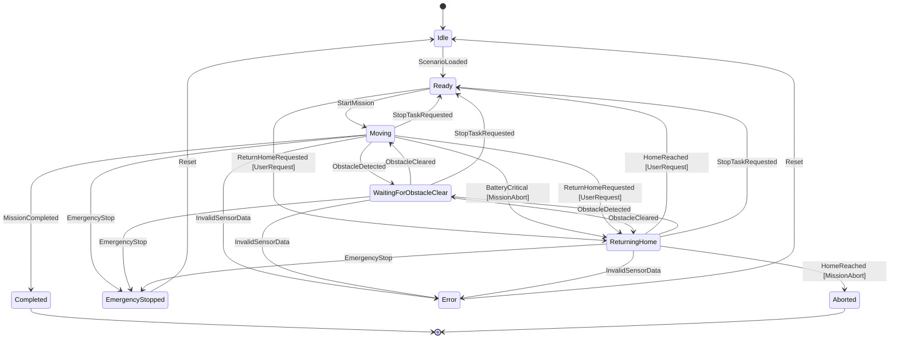

# RobotStateMachine — State Diagram

This diagram reflects the transition table actually implemented in
[`src/RobotStateMachine.cpp`](../src/RobotStateMachine.cpp). It is not an
aspirational design — every arrow below corresponds to a `case` in
`RobotStateMachine::processEvent`.



## Why `WaitingForObstacleClear` has two outgoing `ObstacleCleared` arrows

Mermaid state diagrams have no built-in way to express "resume whatever
state I was interrupted from." In the real implementation there is only
**one** `WaitingForObstacleClear` state, not two — the diagram shows two
`ObstacleCleared` arrows out of it (to `Moving` and to `ReturningHome`)
because both are genuinely reachable, not because the state is secretly
split in two.

The mechanism is a private field on `RobotStateMachine`:

```cpp
RobotState resumeState_;
```

When an `ObstacleDetected` event arrives while `Moving` or `ReturningHome`,
the machine records the current state into `resumeState_` *before*
switching to `WaitingForObstacleClear`:

```cpp
case EventType::ObstacleDetected:
    resumeState_ = RobotState::Moving;      // or RobotState::ReturningHome
    state_ = RobotState::WaitingForObstacleClear;
```

When `ObstacleCleared` later arrives, the machine reads that field back:

```cpp
case EventType::ObstacleCleared:
    state_ = resumeState_;
```

So the diagram's two `ObstacleCleared` arrows represent the two values
`resumeState_` can hold at that point — not two different waiting states.
This confirms both required flows are implemented:

```text
Moving -> WaitingForObstacleClear -> Moving
ReturningHome -> WaitingForObstacleClear -> ReturningHome
```

## Why `ReturningHome` has two outgoing `HomeReached` arrows (`ReturnHomeReason`)

Same pattern as above: mermaid has no built-in way to express "branch based
on why I entered this state," so the diagram shows two `HomeReached` arrows
out of `ReturningHome` — to `Ready` and to `Aborted` — because both are
genuinely reachable, driven by one private field on `RobotStateMachine`:

```cpp
enum class ReturnHomeReason { None, MissionAbort, UserRequest };
ReturnHomeReason returnHomeReason_;
```

- **`ReturnHomeReason::UserRequest`** — set when `ReturnHomeRequested` is
  accepted (from `Ready` or `Moving`): the operator explicitly asked the
  robot to return home. `HomeReached` then leads to **`Ready`** — the robot
  is simply parked at base with no mission actively running, and can
  immediately accept a new `StartMission` or another `ReturnHomeRequested`
  (this is what lets the interactive `R` command be used more than once per
  session).
- **`ReturnHomeReason::MissionAbort`** — set when `BatteryCritical` is
  accepted from `Moving`: an automatic mission-abort trigger. `HomeReached`
  then leads to **`Aborted`**, preserving the original "mission ended
  abnormally" outcome.

The same physical `ReturningHome` state can therefore represent two
different mission outcomes depending on *why* the robot entered it —
`returnHomeReason_` is what `HomeReached` reads to decide which one
applies. It is reset to `None` on every exit from `ReturningHome`
(`HomeReached`, `StopTaskRequested`, and indirectly via
`EmergencyStopped`/`Error`'s own `Reset`), so a stale reason can never leak
into a later, unrelated mission. It is only meaningful while
`currentState() == ReturningHome`.

## `StopTaskRequested` — normal task cancellation, not `EmergencyStop`

`StopTaskRequested` is the user explicitly cancelling whatever task is
currently running. It is **not** a safety fault and must not be confused
with `EmergencyStop`. Accepted from three states, always landing in
`Ready`:

- `Moving` — cancel an in-progress Roam/mission.
- `ReturningHome` — cancel an in-progress Return Home, whether
  user-requested or mission-abort-triggered.
- `WaitingForObstacleClear` — cancel a Roam or Return Home that is
  currently paused by an obstacle.

In all three cases `returnHomeReason_` ends up `None` (explicitly reset, or
implicitly because `Moving` never set it in the first place), so the robot
lands in a clean, reusable `Ready` state, ready to accept a new
`StartMission` or `ReturnHomeRequested` immediately.

`StopTaskRequested` operates purely at the FSM level. In
`RobotSimulator3D`, the physical robot's Safety drive-authority tier
(table-edge/cliff recovery — see
[`technical-decisions.md`](technical-decisions.md)) is independent of
`RobotState` and can remain temporarily active even after the FSM has
already reached `Ready`, if a table-edge recovery was already in progress
when the stop was issued — Safety always outranks the FSM's own drive
intent regardless of which `RobotState` is current.

## Unspecified state/event pairs

Any `(state, event)` combination not shown as an arrow above — for example
`Idle + MissionCompleted`, or any event sent to `Completed` or `Aborted` —
is rejected by `RobotStateMachine::processEvent`. It returns
`TransitionResult::InvalidTransition` and leaves `state_` unchanged. No
exception is thrown; this is treated as a normal, expected outcome, not an
error (see [`technical-decisions.md`](technical-decisions.md#error-handling)).

`Completed` and `Aborted` are terminal in the current implementation: no
event moves the machine out of either state.
